# TDD Webapp Generation Workflow — Complete Flow Diagrams

> Generated 2026-03-30. Render with any Mermaid-compatible viewer (GitHub, VS Code preview, mermaid.live).

---

## 1. Master Overview

High-level phase sequence with entry points, clearing boundaries, and iteration loops.

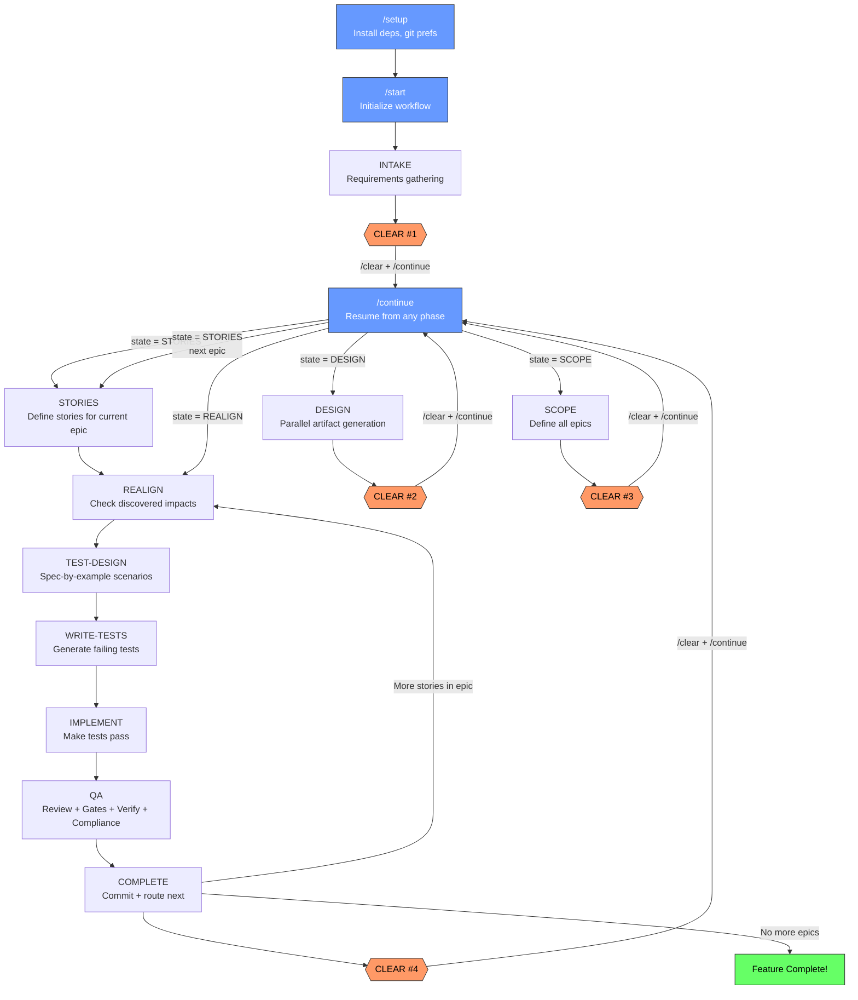

---

## 2. /setup and /start Initialization

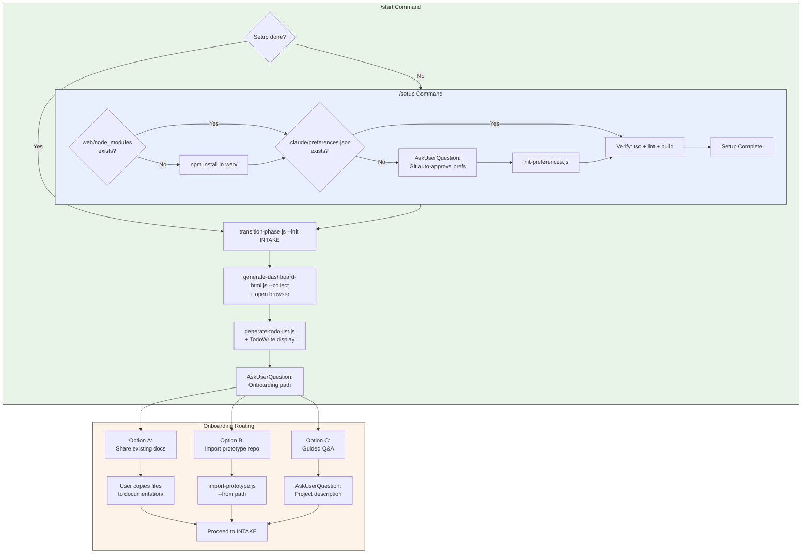

---

## 3. /continue Dispatcher Pattern

The parent orchestrator is limited to 2-3 tool calls to avoid a Claude Code hook-dispatch bug.

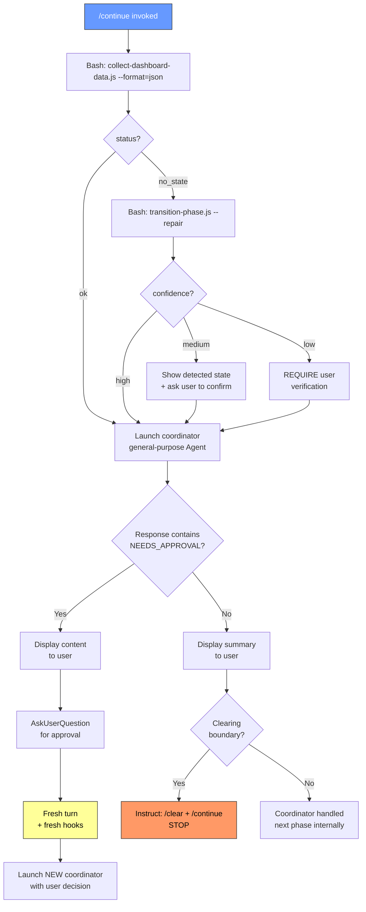

---

## 4. INTAKE Phase

Three sequential agents with optional prototype review for v2 imports.

```mermaid
flowchart TD
    subgraph INTAKE_PHASE["INTAKE Phase"]
        direction TB

        subgraph AGENT1["intake-agent"]
            IA_A["Call A: Scan documentation/<br/>Detect mode (1=specs, 2=partial, 3=scratch)"]
            IA_ORCH["Orchestrator: Display scan summary<br/>Ask 5-6 mandatory questions"]
            IA_Q1["Q1: Roles & Permissions"]
            IA_Q2["Q2: Styling & Branding"]
            IA_Q3["Q3: API & Backend<br/>(dataSource + specCompleteness)"]
            IA_Q4["Q4: Authentication Method<br/>POLICY: authentication-intake.md"]
            IA_Q5["Q5: Compliance & Regulatory<br/>POLICY: compliance-intake.md"]
            IA_Q6{"has_wireframes?"}
            IA_Q6Y["Q6: Wireframe quality"]
            IA_B["Call B: Produce intake-manifest.json<br/>with scan results + user answers"]
            IA_SHOW["Display manifest summary"]
            IA_APPROVE{"User approves<br/>manifest?"}
            IA_C["Call C: Revise manifest"]

            IA_A --> IA_ORCH
            IA_ORCH --> IA_Q1 --> IA_Q2 --> IA_Q3 --> IA_Q4 --> IA_Q5 --> IA_Q6
            IA_Q6 -->|Yes| IA_Q6Y --> IA_B
            IA_Q6 -->|No| IA_B
            IA_B --> IA_SHOW --> IA_APPROVE
            IA_APPROVE -->|"Looks good"| PROTO_CHECK
            IA_APPROVE -->|"I'd change things"| IA_C
            IA_C --> IA_SHOW
        end

        PROTO_CHECK{"v2 prototype<br/>format?"}

        subgraph PROTO["prototype-review-agent (v2 only)"]
            PR_A["Export .pen screenshots<br/>Extract enrichments from genesis.md<br/>Flag assumptions<br/>Cross-validate API specs<br/>Pre-map genesis sections to FRS"]
        end

        subgraph AGENT2["intake-brd-review-agent"]
            BRD_A["Call A: Gap analysis<br/>Review manifest + docs vs 9 FRS sections"]
            BRD_ORCH["Orchestrator: Display gaps<br/>Ask clarifying questions per section"]
            BRD_B["Call B: Produce<br/>feature-requirements.md (FRS)"]
            BRD_SHOW["Display FRS summary:<br/>requirement count, business rules, sections"]
            BRD_APPROVE{"User approves<br/>FRS?"}
            BRD_C["Call C: Finalize<br/>Commit + push + transition to DESIGN"]

            BRD_A --> BRD_ORCH --> BRD_B --> BRD_SHOW --> BRD_APPROVE
            BRD_APPROVE -->|"Looks good"| BRD_C
            BRD_APPROVE -->|"I'd change things"| BRD_A
        end

        PROTO_CHECK -->|Yes| PROTO --> AGENT2
        PROTO_CHECK -->|No| AGENT2

        BRD_C --> CB1_INT{{"CLEARING BOUNDARY #1<br/>/clear + /continue"}}
    end

    style CB1_INT fill:#f96,stroke:#333,color:#000
    style PROTO fill:#fef,stroke:#333
```

---

## 5. DESIGN Phase

Parallel Call A execution, sequential approvals, then autonomous agents.

```mermaid
flowchart TD
    subgraph DESIGN_PHASE["DESIGN Phase"]
        READ_MANIFEST["Read intake-manifest.json<br/>Determine which artifacts to generate"]

        subgraph COPY["Copy User-Provided Files"]
            COPY_CHECK{"generate == false<br/>+ userProvided?"}
            COPY_RUN["copy-with-header.js<br/>--from source --to generated-docs/specs/"]
        end

        subgraph PARALLEL_A["Parallel Call A (all at once)"]
            direction LR
            API_A["design-api-agent<br/>Call A: Draft API spec"]
            STYLE_A["design-style-agent<br/>Call A: Draft design tokens"]
            WIRE_A["design-wireframe-agent<br/>Call A: Draft wireframes"]
        end

        WIRE_SKIP{"wireframes.generate<br/>=== false?<br/>(v2 .pen screenshots)"}

        subgraph APPROVALS["Sequential Approvals (fixed order)"]
            API_APPR["API Spec: Display + AskUserQuestion"]
            STYLE_APPR["Design Tokens: Display + AskUserQuestion"]
            WIRE_APPR["Wireframes: Display + AskUserQuestion"]
        end

        subgraph PARALLEL_B["Parallel Call B"]
            direction LR
            API_B["design-api-agent<br/>Call B: Write spec"]
            STYLE_B["design-style-agent<br/>Call B: Write tokens"]
        end

        subgraph AUTO["Autonomous Agents + Wireframe Call B (parallel)"]
            direction LR
            MOCK["mock-setup-agent<br/>Generate MSW handlers"]
            TYPES["type-generator-agent<br/>Generate TS types"]
            WIRE_B["design-wireframe-agent<br/>Call B: Write wireframes"]
        end

        WIRE_APPR2["Wireframe approval<br/>+ Call C"]

        FINALIZE["Commit + transition-phase.js --to SCOPE --verify-output"]
        CB2_INT{{"CLEARING BOUNDARY #2<br/>/clear + /continue"}}

        READ_MANIFEST --> COPY
        COPY_CHECK -->|Yes| COPY_RUN
        COPY_CHECK -->|No| PARALLEL_A
        COPY_RUN --> PARALLEL_A

        READ_MANIFEST --> WIRE_SKIP
        WIRE_SKIP -->|Yes, skip wireframe agent| PARALLEL_A
        WIRE_SKIP -->|No, include it| PARALLEL_A

        PARALLEL_A --> APPROVALS
        APPROVALS --> PARALLEL_B
        PARALLEL_B --> AUTO
        AUTO --> WIRE_APPR2
        WIRE_APPR2 --> FINALIZE
        FINALIZE --> CB2_INT
    end

    subgraph DESIGN_AGENTS_STATE["Design Agent State Tracking"]
        DAS1["transition-phase.js --design-agent set"]
        DAS2["transition-phase.js --design-agent start"]
        DAS3["transition-phase.js --design-agent complete"]
    end

    style CB2_INT fill:#f96,stroke:#333,color:#000
    style PARALLEL_A fill:#e8f0fe,stroke:#333
    style AUTO fill:#e8f0fe,stroke:#333
```

---

## 6. SCOPE and STORIES

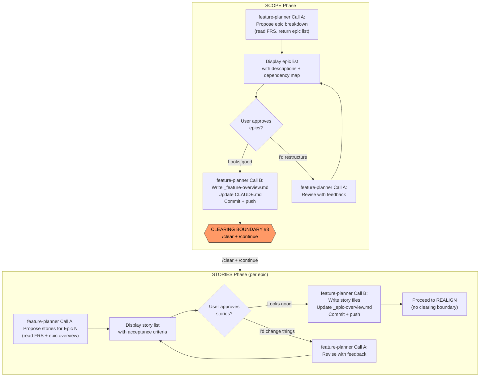

---

## 7. Per-Story TDD Cycle (REALIGN through COMPLETE)

```mermaid
flowchart TD
    subgraph STORY_CYCLE["Per-Story TDD Cycle"]

        subgraph REALIGN_PHASE["REALIGN"]
            RL_A["feature-planner Call A:<br/>Read discovered-impacts.md"]
            RL_CHECK{"Impacts exist<br/>for this story?"}
            RL_AUTO["No impacts:<br/>Auto-transition to TEST-DESIGN"]
            RL_SHOW["Display proposed revisions"]
            RL_APPROVE{"User approves<br/>revisions?"}
            RL_B["feature-planner Call B:<br/>Apply revisions to story<br/>Clear processed impacts"]

            RL_A --> RL_CHECK
            RL_CHECK -->|No| RL_AUTO
            RL_CHECK -->|Yes| RL_SHOW --> RL_APPROVE
            RL_APPROVE -->|Yes| RL_B
            RL_APPROVE -->|"I'd change it"| RL_A
        end

        subgraph TD_PHASE["TEST-DESIGN"]
            TD_A["test-designer Call A:<br/>Produce spec-by-example document<br/>(Setup/Input/Expected tables)"]
            TD_DOC["Write to generated-docs/test-design/"]
            TD_SHOW["Display FULL document<br/>for BA review"]
            TD_APPROVE{"User approves<br/>test design?"}
            TD_REV["test-designer revises"]

            TD_A --> TD_DOC --> TD_SHOW --> TD_APPROVE
            TD_APPROVE -->|"Looks good"| WT
            TD_APPROVE -->|"I have changes"| TD_REV --> TD_SHOW
        end

        subgraph WT_PHASE["WRITE-TESTS (autonomous)"]
            WT["test-generator:<br/>Generate failing tests<br/>from test-design + story"]
            WT_OUT["Tests written to<br/>web/src/__tests__/integration/"]
        end

        subgraph IMPL_PHASE["IMPLEMENT (autonomous)"]
            IMPL_TESTS["Run npm test<br/>Capture failing tests"]
            IMPL_A["developer Call A:<br/>Write code to make<br/>all tests pass"]
            IMPL_B["developer Call B:<br/>Pre-flight test check<br/>Fix any remaining failures"]
        end

        subgraph QA_PHASE["QA (see detailed diagram below)"]
            QA_ENTER["Code review + Gates<br/>+ Manual verify<br/>+ Spec compliance<br/>+ Commit"]
        end

        COMPLETE_CHECK{"Next action?"}
        NEXT_STORY["Next story in epic:<br/>REALIGN"]
        NEXT_EPIC{{"CLEARING BOUNDARY #4<br/>Next epic: /clear + /continue → STORIES"}}
        FEATURE_DONE["Feature Complete!"]

        RL_AUTO --> TD_PHASE
        RL_B --> TD_PHASE
        WT --> WT_OUT --> IMPL_TESTS
        IMPL_TESTS --> IMPL_A --> IMPL_B
        IMPL_B --> QA_PHASE
        QA_ENTER --> COMPLETE_CHECK
        COMPLETE_CHECK -->|"More stories"| NEXT_STORY
        COMPLETE_CHECK -->|"Last story,<br/>more epics"| NEXT_EPIC
        COMPLETE_CHECK -->|"No more epics"| FEATURE_DONE
        NEXT_STORY --> REALIGN_PHASE
    end

    style NEXT_EPIC fill:#f96,stroke:#333,color:#000
    style FEATURE_DONE fill:#6f6,stroke:#333,color:#000
    style WT_PHASE fill:#e8f0fe,stroke:#333
    style IMPL_PHASE fill:#e8f0fe,stroke:#333
```

---

## 8. QA Phase — Detailed

Three scoped calls + manual verification + fix cycle + spec compliance.

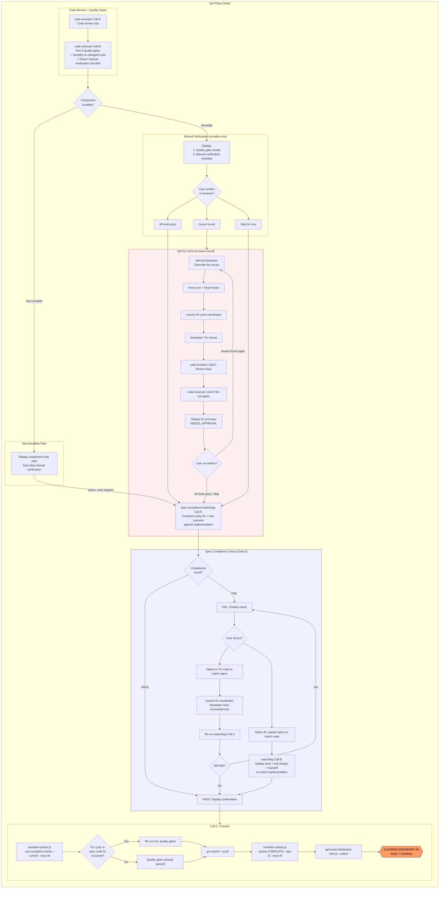

---

## 9. Quality Gates (6 Gates)

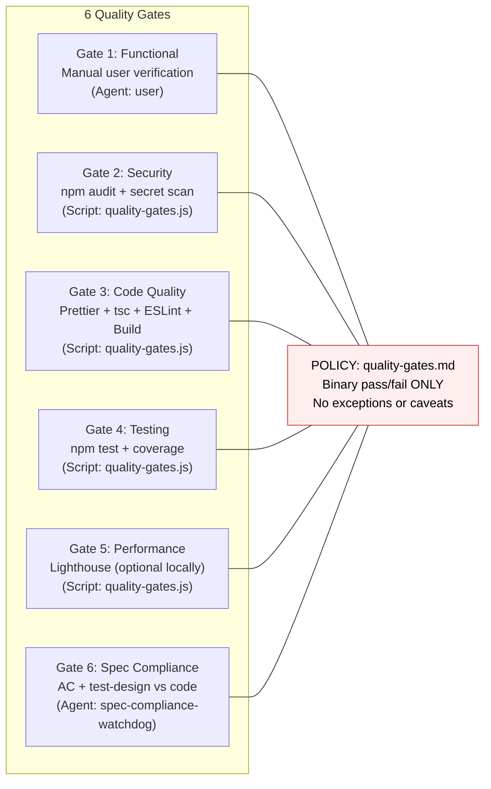

---

## 10. Hooks & Infrastructure

```mermaid
flowchart TD
    subgraph HOOKS["Hook System (settings.json)"]
        direction TB

        subgraph LIFECYCLE["Lifecycle Hooks"]
            H_SS["SessionStart<br/>capture-context.ps1<br/>+ inject-phase-context.ps1"]
            H_SE["SessionEnd<br/>capture-context.ps1"]
            H_PS["UserPromptSubmit<br/>capture-context.ps1"]
            H_PC["PreCompact<br/>capture-context.ps1"]
            H_ST["Stop<br/>capture-context.ps1"]
            H_NF["Notification<br/>capture-context.ps1"]
        end

        subgraph AGENT_HOOKS["Agent Hooks"]
            H_SAS["SubagentStart<br/>capture-context.ps1<br/>+ inject-agent-context.ps1*"]
            H_SAE["SubagentStop<br/>capture-context.ps1"]
            AGENTS_LIST["*inject-agent-context for:<br/>developer, test-generator,<br/>code-reviewer, feature-planner,<br/>design-api/style/wireframe-agent,<br/>intake-agent, intake-brd-review-agent"]
        end

        subgraph TOOL_HOOKS["Tool Hooks"]
            H_BASH["PreToolUse (Bash)<br/>bash-permission-checker.js<br/>Auto-approve safe commands"]
            H_PRE["PreToolUse (all)<br/>capture-context.ps1"]
            H_POST["PostToolUse (all)<br/>capture-context.ps1"]
            H_WRITE["PostToolUse (Write/Edit)<br/>generate-progress-index.js"]
            H_PERM["PermissionRequest<br/>capture-context.ps1"]
        end
    end

    subgraph BASH_CHECKER["bash-permission-checker.js"]
        BC_DENY["DENY: rm -rf /, SSH keys,<br/>credentials, force-push,<br/>--no-verify"]
        BC_ALLOW["ALLOW: npm/npx, node scripts<br/>in safe dirs, git ops<br/>(per preferences.json),<br/>curl localhost only"]
        BC_DIRS["Safe dirs: documentation/,<br/>web/, generated-docs/,<br/>.claude/, .github/"]
    end

    subgraph SCRIPTS["Key Scripts (.claude/scripts/)"]
        direction TB
        SC_TP["transition-phase.js<br/>--init, --to, --complete,<br/>--repair, --show,<br/>--design-agent, --verify-output,<br/>--pre-complete-checks"]
        SC_CD["collect-dashboard-data.js<br/>--format=json|text"]
        SC_DH["generate-dashboard-html.js<br/>--collect"]
        SC_TL["generate-todo-list.js"]
        SC_QG["quality-gates.js<br/>--auto-fix, --json,<br/>--fail-fast, --sequential"]
        SC_VP["validate-phase-output.js<br/>--phase, --epic, --story"]
        SC_CW["copy-with-header.js<br/>--from, --to"]
        SC_IP["import-prototype.js<br/>--from"]
        SC_PR["init-preferences.js<br/>--autoApproveCommit,<br/>--autoApprovePush"]
    end

    subgraph POLICIES["Policies (.claude/policies/)"]
        P_AUTH["authentication-intake.md<br/>Never skip/simplify auth questions<br/>BFF vs frontend-only vs custom"]
        P_COMP["compliance-intake.md<br/>Keyword triggers for<br/>PCI-DSS, GDPR, HIPAA, etc."]
        P_QG["quality-gates.md<br/>Binary pass/fail<br/>6 gates defined"]
    end

    H_BASH --> BASH_CHECKER

    style HOOKS fill:#f0f0ff,stroke:#333
    style BASH_CHECKER fill:#fff0f0,stroke:#333
    style SCRIPTS fill:#f0fff0,stroke:#333
    style POLICIES fill:#fff8e8,stroke:#333
```

---

## 11. State Management & Artifacts

```mermaid
flowchart TD
    subgraph STATE["State Management"]
        WS["workflow-state.json<br/>(generated-docs/context/)"]
        TP["transition-phase.js<br/>Reads/writes state"]
        DS["detect-workflow-state.js<br/>Scans artifacts to recover state"]
        WH["lib/workflow-helpers.js<br/>Shared utilities"]
    end

    subgraph ARTIFACTS["Generated Artifacts by Phase"]
        direction TB
        ART_INT["INTAKE:<br/>intake-manifest.json<br/>feature-requirements.md"]
        ART_DES["DESIGN:<br/>api-spec.yaml<br/>design-tokens.css + .md<br/>wireframes/<br/>web/src/mocks/handlers.ts<br/>web/src/types/api-generated.ts"]
        ART_SCP["SCOPE:<br/>_feature-overview.md<br/>epic-N-name/ directories"]
        ART_STR["STORIES:<br/>story-M-name.md<br/>_epic-overview.md"]
        ART_TD["TEST-DESIGN:<br/>story-M-name-test-design.md<br/>story-M-name-test-handoff.md"]
        ART_WT["WRITE-TESTS:<br/>*.test.tsx in<br/>web/src/__tests__/integration/"]
        ART_IMP["IMPLEMENT:<br/>Components, pages,<br/>API functions in web/src/"]
        ART_QA["QA:<br/>quality-gate-status.json<br/>git commit"]
    end

    subgraph TRACEABILITY["AC Traceability Chain"]
        TR1["Story file<br/>AC-1, AC-2, ..."]
        TR2["Test-design doc<br/>AC → Scenario mapping"]
        TR3["Test files<br/>AC-N references in code"]
        TR4["Implementation<br/>Code satisfying ACs"]
        TR5["Spec compliance<br/>Verify AC coverage"]

        TR1 --> TR2 --> TR3 --> TR4 --> TR5
    end

    TP --> WS
    DS --> WS

    style STATE fill:#e8f0fe,stroke:#333
    style TRACEABILITY fill:#f0fff0,stroke:#333
```

---

## 12. Agent Reference

All 14 agents and when they are invoked.

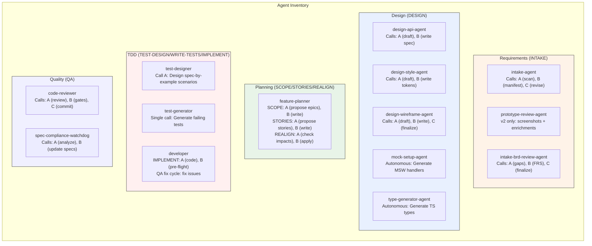

---

## 13. Complete Linear Flow (Condensed)

One-line-per-step walkthrough of the entire process.

```
/setup          → Install deps → Git prefs → Verify build
                    |
/start          → Init state → Dashboard → Onboarding routing
                    |
INTAKE          → intake-agent (scan → questions → manifest)
                → [v2? prototype-review-agent]
                → intake-brd-review-agent (gaps → FRS)
                → COMMIT → CLEAR #1
                    |
/continue       → collect state → launch coordinator
                    |
DESIGN          → [copy user files]
                → Parallel: api-agent + style-agent + [wireframe-agent]
                → Sequential approvals
                → Parallel: Call B + autonomous agents
                → COMMIT → CLEAR #2
                    |
SCOPE           → feature-planner (propose → approve → write epics)
                → COMMIT → CLEAR #3
                    |
STORIES         → feature-planner (propose → approve → write stories)
                → (no clearing boundary — proceed to first story)
                    |
  +--------------+-----------------------------------------------------+
  |              FOR EACH STORY IN EPIC                                 |
  |                                                                     |
  |  REALIGN     → Check discovered-impacts.md                          |
  |              → [impacts? propose revisions → approve → apply]       |
  |              → [no impacts? auto-proceed]                           |
  |                  |                                                  |
  |  TEST-DESIGN → test-designer (scenarios → BA review → approve)     |
  |                  |                                                  |
  |  WRITE-TESTS → test-generator (failing tests) [autonomous]         |
  |                  |                                                  |
  |  IMPLEMENT   → npm test (capture failures)                         |
  |              → developer Call A (make tests pass)                   |
  |              → developer Call B (verify all pass) [autonomous]      |
  |                  |                                                  |
  |  QA          → code-reviewer Call A (review)                        |
  |              → code-reviewer Call B (5 quality gates + checklist)    |
  |              → Manual verification (user checks browser)            |
  |              → [issues? fix cycle → re-verify]                      |
  |              → spec-compliance-watchdog (Gate 6)                    |
  |              → [fail? fix code or update specs]                     |
  |              → code-reviewer Call C (commit)                        |
  |              → CLEAR #4                                             |
  |                                                                     |
  |  COMPLETE    → More stories? → loop back to REALIGN                 |
  |              → Last story? → CLEAR #4 for next epic                 |
  +--------------+-----------------------------------------------------+
                    |
  FOR EACH EPIC  → /continue → STORIES for next epic → story loop
                    |
  ALL DONE       → Feature Complete!
```
